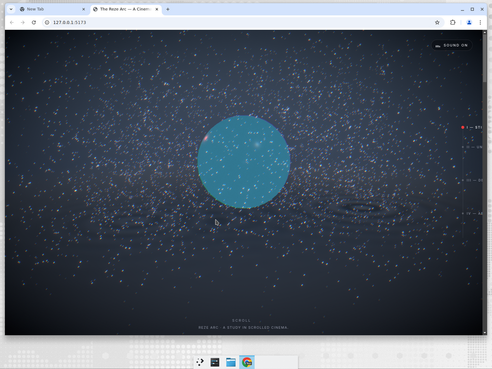
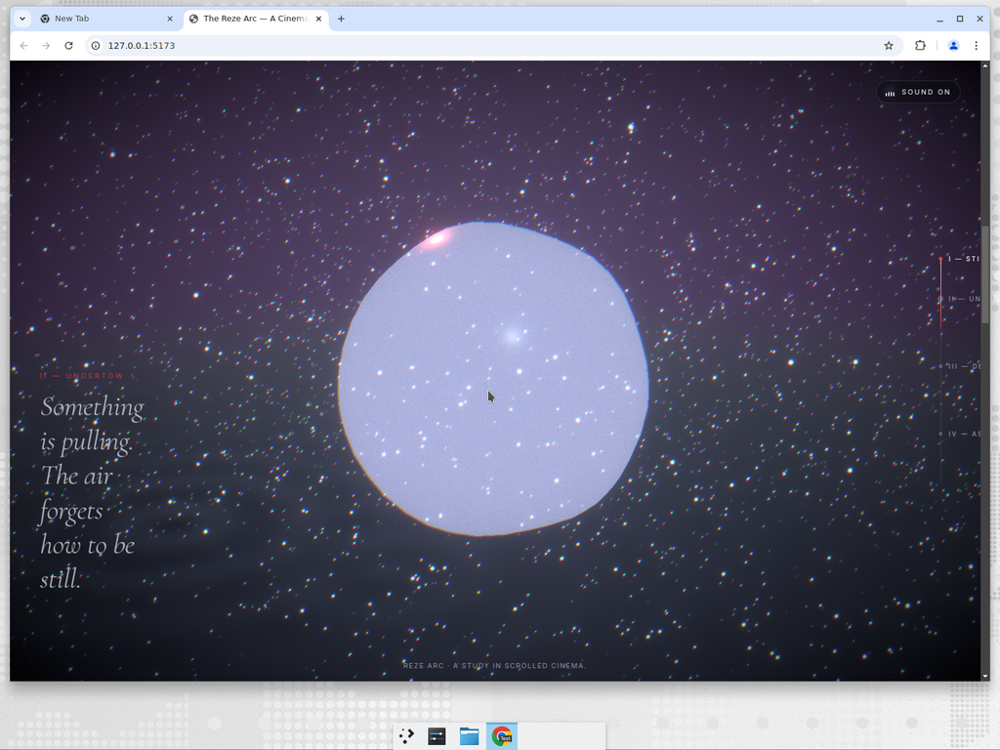
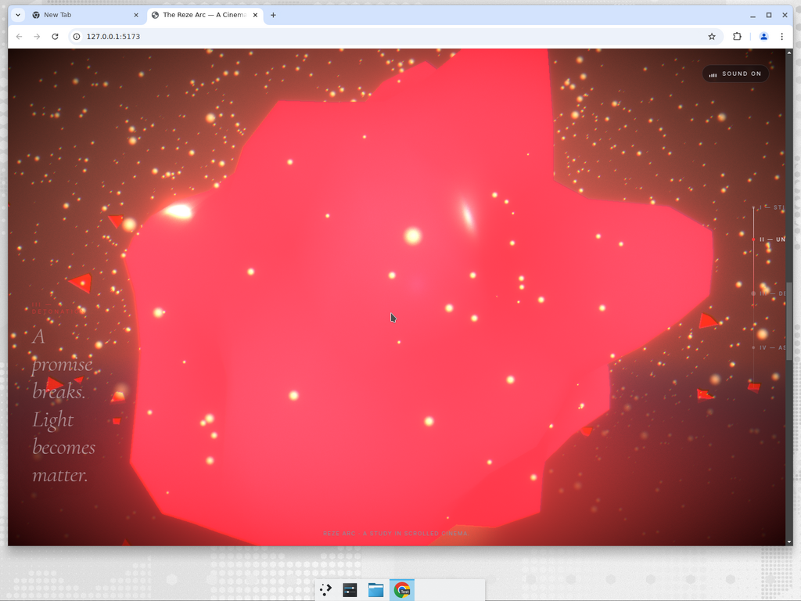
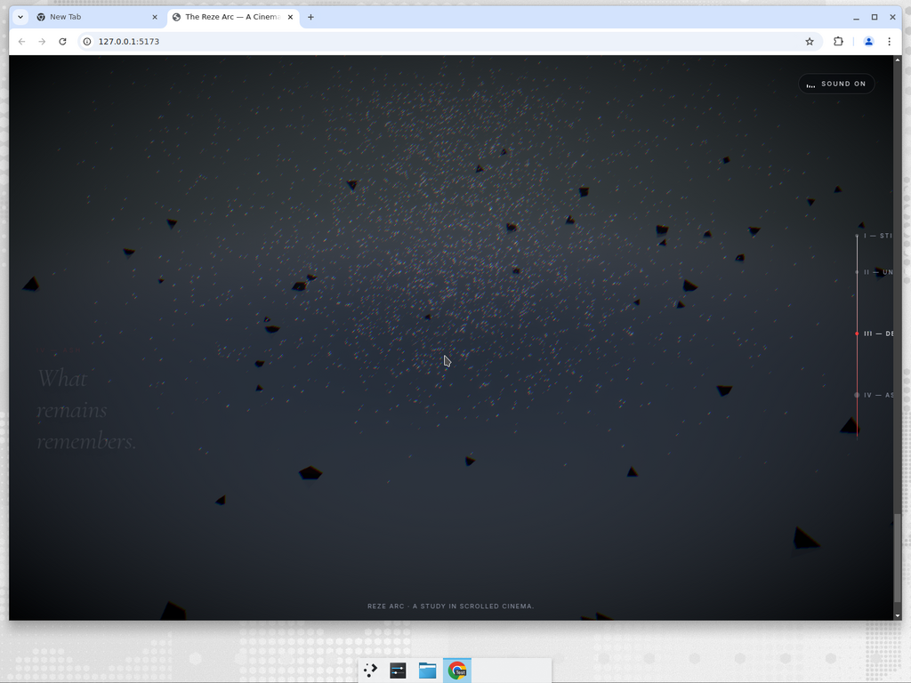

# The Reze Arc

A **cinematic, scroll-driven WebGL experience** inspired by the _Reze Arc_ —
built as a portfolio-grade flagship piece, not a demo. Four movements:
**stillness → undertow → detonation → ash.**

| I — Stillness | II — Undertow |
|---|---|
|  |  |

| III — Detonation | IV — Ash |
|---|---|
|  |  |

> Built with **React · React Three Fiber · Drei · @react-three/postprocessing ·
> Lenis · Zustand · Three.js**. No 3D assets shipped — the entire experience
> is procedural (shaders + instanced primitives + synthesised audio), so it
> loads instantly.

---

## Creative direction

The Reze Arc is not rendered as sections — it is scored as a **timeline**.
Scroll is a film reel; every subsystem reads a single normalized progress
`t ∈ [0, 1]` and renders itself:

| range | act | camera | lighting | audio | particles |
|---|---|---|---|---|---|
| 0.00 – 0.18 | **Stillness** — rooftop drift | wide, low, slow dolly | cool blue, low key | filtered pink-noise rain bed | ambient embers |
| 0.18 – 0.48 | **Undertow** — something pulls | tighter, higher, orbit | bruised violet | sub-bass drone swells | coalescing swirl |
| 0.48 – 0.78 | **Detonation** — a promise breaks | whip-pan, push-in, shake | hot amber / red | FM impact + bell tail | radial shockwave + debris |
| 0.78 – 1.00 | **Ash** — what remains | slow pull back | near-mono grey | bell decay, rain returns | drifting, falling, cooling |

Every transition is **gradient, not a step**. Chapters overlap at their
boundaries so the viewer is always mid-shot.

---

## Architecture

```
src/
├── timeline/              ⟵ the single source of truth
│   ├── timeline.ts        keyframes (camera shots, chapters)
│   ├── cameraRig.ts       key interpolation + easing
│   ├── easing.ts          film-grade easing curves
│   └── types.ts
├── hooks/
│   ├── useScrollTimeline  Lenis → normalized progress → subscriber bus
│   └── useAudioEngine     mounts procedural audio + sync's to progress
├── state/store.ts         zustand (UI-only, per-frame values stay in refs)
├── audio/engine.ts        procedural layered soundscape (zero assets)
├── scene/
│   ├── Stage.tsx          <Canvas>, tonemap, DPR clamp, preload
│   ├── CameraRig.tsx      reads timeline → damped camera pose
│   ├── Environment.tsx    sky dome, floor, shockwave, dynamic lights
│   ├── Icon.tsx           central symbol (fracturing icosahedron + core)
│   ├── particles/
│   │   ├── Sparks.tsx     6k GPU points, progress-driven emission + impulse
│   │   └── Debris.tsx     140 instanced tetrahedra w/ rigid-body-ish physics
│   ├── shaders/
│   │   ├── iconMaterial.ts     onBeforeCompile displacement + emissive remap
│   │   ├── floorMaterial.ts    wet-asphalt + rain ripples + fire pool
│   │   ├── skyMaterial.ts      four-state color gradient + stars
│   │   └── shockwaveMaterial.ts expanding ring (additive)
│   └── PostFX.tsx         bloom · chromatic aberration · noise · vignette
├── ui/
│   ├── IntroOverlay.tsx   user-gesture audio unlock + cinematic opening
│   ├── ProgressRail.tsx   vertical scroll rail + chapter dots
│   ├── ChapterLabels.tsx  cross-fading titles (raw DOM writes, no re-renders)
│   ├── AudioToggle.tsx
│   └── ScrollHint.tsx
└── App.tsx                wires it together
```

### The timeline bus

`useScrollTimeline` initializes Lenis and pushes `{progress, velocity}` to a
global `timelineBus` on every RAF tick. Any renderer can read
`timelineBus.progress` in its `useFrame` callback — no React re-renders, no
prop drilling, no store churn. UI elements that _aren't_ inside the canvas
(chapter titles, progress rail) subscribe through
`timelineBus.subscribe(fn)` and write directly to DOM to stay in the same
no-re-render budget.

### Camera rig

Timeline keys (`position`, `target`, `fov`, `ease`) are interpolated with the
keyframe's easing, then fed through a critically-damped follower
(`damp(current, target, lambda, dt)`). Scroll velocity is added as parallax;
a small procedural shake is layered in during the detonation beat for
tactile punch. No hardcoded position magic — new shots = new keyframes.

### Shaders

`iconMaterial` uses `MeshStandardMaterial.onBeforeCompile` so we keep PBR
lighting, shadow casting, and tonemapping for free, while injecting:

- cheap 3D-hash noise for **breathing displacement** that intensifies with
  tension,
- a **crack field** that opens up during shatter, exposing an emissive inner
  core,
- **emissive recolouring** from cold cyan → hot red along the arc.

The floor is a custom `ShaderMaterial` that blends a wet-asphalt base with
animated rain drops (multi-drop ripple SDF) and a radial fire pool during
detonation. The sky is four colour gradients mixed by independent band
weights (so the transition isn't monotonic — violet tension actually _cools_
slightly before the amber detonation hits).

### Particles

- **Sparks** — 6000 `Points`, one draw call. Per-particle simulation
  (position, velocity, lifetime) is CPU-side in tight typed-array loops.
  During detonation we fire a one-shot radial impulse; thereafter respawn
  spawns particles close to the core instead of throughout the scene so the
  explosion has a proper tail.
- **Debris** — 140 tumbling tetrahedra via `InstancedMesh`. Single draw
  call, per-instance rotation velocity, soft floor bounce. Hidden until the
  detonation trigger; then seeded with a spherical impulse.

### Audio

100% procedural — a synthesised soundscape built from `OscillatorNode`,
filtered noise buffers, and an FM patch for the detonation impact. Five
layers crossfade across the timeline:

- **rain** — filtered pink noise
- **drone** — two detuned saws, LPF sweeps with tension
- **swell** — sub-bass sine
- **impact** — FM burst + resonant band-pass noise (one-shot at `t ≈ 0.55`)
- **bell** — decaying sine that rides the aftermath

Muting is a smooth master-gain crossfade (no pops). This also means zero
audio assets to bundle, zero licensing concerns, and instant playback.

### Postprocessing

Bloom + ChromaticAberration + Noise + Vignette. Bloom's threshold is low so
emissive materials always bleed — we then drive the _perceived_ bloom
intensity through the shaders themselves (icon's glow ramps, floor fire
pool, shockwave brightness), not by mutating effect instances. This keeps
the render loop purely data-driven and sidesteps compatibility pitfalls with
the underlying postprocessing library.

---

## Running it

```bash
pnpm i        # or npm install
pnpm dev      # local dev at http://localhost:5173
pnpm build    # production bundle
pnpm lint
```

Node ≥ 22 · TypeScript 6 · Vite 8.

---

## Performance checklist

- [x] One draw call per particle system (InstancedMesh / Points).
- [x] `AdaptiveDpr` + `AdaptiveEvents` for graceful degradation.
- [x] DPR clamped `[1, 1.75]` — caps retina overdraw.
- [x] `antialias: false` — bloom + DPR do the heavy lifting; saves a pass.
- [x] Shader uniforms mutated in-place, no material swaps per frame.
- [x] Subscribers read `timelineBus.progress` directly in `useFrame` — zero
      React re-renders during scroll.
- [x] Sky + floor are single-plane / single-sphere — no tessellation bloat.
- [x] Chapter labels & progress rail update via raw DOM writes.
- [x] `multisampling: 0` on the post composer.
- [x] Tone-mapped to ACES Filmic with exposure 1.05 for filmic colour.

### Asset pipeline note

No GLTF assets ship in this build by design — everything is procedural so
the experience loads instantly. The project is set up to accept
`GLTFLoader` + `DRACOLoader` + `KTX2Loader` immediately (all three are in
`three/examples/jsm/loaders`); see `docs/loaders.md` (below) for a drop-in
snippet when you add a real model.

```ts
// Example: swap Icon.tsx for a compressed GLTF hero asset.
import { useGLTF } from "@react-three/drei";
useGLTF.preload("/hero.glb"); // place Draco-compressed, KTX2-textured GLB in /public
```

---

## Future upgrades

- **Real model** — replace the procedural icosahedron with a Draco-compressed
  character bust; keep the shatter shader (mix-in via `onBeforeCompile`).
- **VR mode** — `@react-three/xr`, one `XR` component wrapper; the timeline
  already runs independent of DOM scroll, so gaze/controller can drive
  progress instead.
- **Multiplayer ambient** — Liveblocks presence broadcasting individual scroll
  progresses; render the other viewers as faint constellations in the sky
  shader.
- **Audio stems** — swap the procedural engine for 5 decoded OPUS stems when
  you want vocals/instruments; the `AudioHandle` interface stays the same.
- **GPU particle sim** — move the Sparks integrator from the CPU to a
  `THREE.RenderTarget` ping-pong using `@react-three/gpgpu`; unlocks 100k+
  particles.
- **Motion-safe mode** — watch `prefers-reduced-motion`, snap camera to
  chapter anchors instead of streaming.

---

## Credits

A self-contained study in scrolled cinema. Inspired by the emotional cadence
of the _Reze Arc_ (Chainsaw Man), Awwwards-caliber immersive sites, and
Apple's product storytelling pages.
